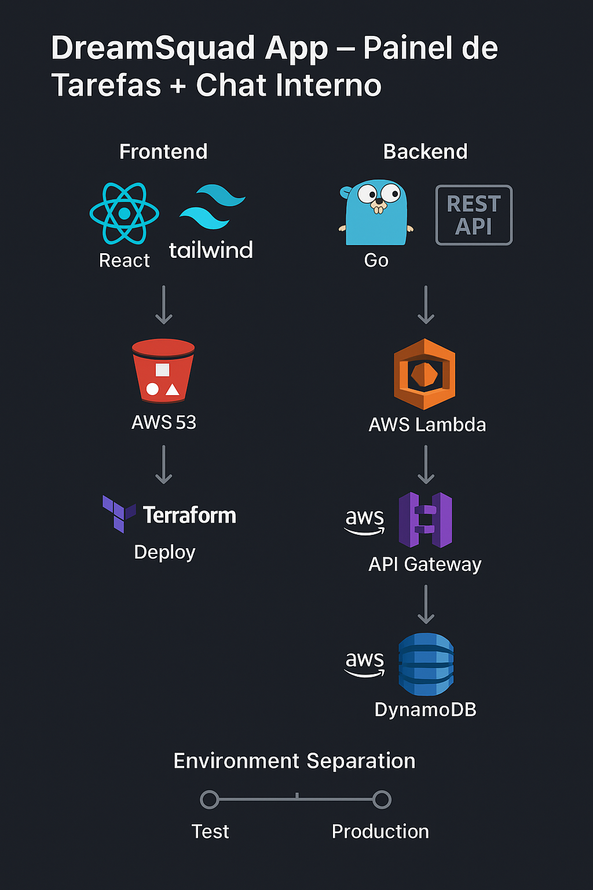

DreamSquad App — Painel de Tarefas + Chat Interno

Aplicação web fullstack com Frontend em React e Backend em Go, projetada para ser hospedada em infraestrutura de nuvem de baixo custo usando AWS S3, Lambda, API Gateway e Terraform.

O objetivo é fornecer um painel de tarefas interno integrado a um chat de equipe, priorizando baixo custo operacional, separação de ambientes (teste/produção) e infraestrutura automatizada.

🎯 Objetivos do Projeto
Criar uma aplicação responsiva e ágil para gerenciamento interno de tarefas e comunicação.

Utilizar React no frontend e Go no backend para maximizar performance e escalabilidade.

Garantir custo próximo de zero usando o Free Tier da AWS.

Utilizar Terraform para provisionar infraestrutura como código, com deploy automatizado.

Hospedar frontend e backend em S3 e serviços AWS de baixo custo.

Separar ambientes de teste e produção para segurança e flexibilidade.

Documentar todo o processo para permitir replicação e manutenção futura.

🛠️ Stack Tecnológica

Frontend

React (Create React App)
TailwindCSS (estilização utilitária)
PostCSS + Autoprefixer

Backend

Go (API para gerenciamento de tarefas e chat)
Comunicação REST/JSON para integração com o frontend
Infraestrutura e Deploy
AWS S3 (Frontend estático)
AWS Lambda + API Gateway (Backend serverless)
AWS DynamoDB (armazenamento)
Terraform (infraestrutura como código)
Git (controle de versão e integração contínua futura)

Infraestrutura e Deploy

AWS S3 (hospedagem estática e backend serverless)
AWS Lambda + API Gateway (execução do backend sob demanda)
Terraform (Infraestrutura como código)
GitHub/GitLab (controle de versão e CI/CD futuro)

🎨 Estilização e Organização do Frontend
A camada visual utiliza TailwindCSS, garantindo velocidade no desenvolvimento e consistência no design.

Configuração

Tailwind integrado ao Create React App via PostCSS e Autoprefixer.
Diretivas @tailwind base;, @tailwind components; e @tailwind utilities; aplicadas no src/index.css.
tailwind.config.js configurado para purge automático, reduzindo tamanho final do CSS.

Organização

Classes utilitárias diretamente no JSX para prototipagem rápida.
Componentes reutilizáveis para botões, formulários e layouts recorrentes.
Paleta de cores e tipografia definidas no tailwind.config.js para manter padrão visual.
Logo da empresa inserida no cabeçalho do painel, reforçando identidade visual.
Essa abordagem reduz sobrecarga de manutenção, facilita evolução do design e mantém o projeto leve e performático.

📌 Etapas do Desenvolvimento
1. Configuração Inicial do Frontend ✅

Criação do projeto React.
Instalação e configuração do TailwindCSS e PostCSS.
Correção de conflitos de dependências.
Validação do ambiente (npm start) com renderização de estilos.
Status: Concluído.

2. Painel de Tarefas (Frontend) 🚧

Componentes para listagem, criação e edição de tarefas.
Layout responsivo com Tailwind.
Estados prontos para integração com API.
Status: Concluído.

3. Backend em Go 🔜

API para:
CRUD de tarefas.
Envio e recebimento de mensagens no chat.
Testes locais (go run).
Status: Planejado.

4. Integração Frontend ↔ Backend 🔜

Configuração de chamadas HTTP.
Teste do fluxo completo (tarefas + chat).
Status: Planejado.

5. Deploy AWS com Terraform 🔜
Scripts para:

Bucket S3 (frontend).
Lambda + API Gateway (backend).
DynamoDB (armazenamento).
Configuração de variáveis para ambientes separados.
Deploy automatizado (terraform apply).
Status: Planejado.

🚀 Como Executar (Frontend)

# Clonar repositório
git clone https://github.com/usuario/dreamsquad-app.git

# Acessar o frontend
cd dreamsquad-app/frontend

# Instalar dependências
npm install

# Rodar servidor de desenvolvimento
npm start

=> A aplicação estará disponível em: http://localhost:3000

📅 Próximos Passos

Finalizar layout do painel de tarefas. (conclúdo)
Criar backend em Go e endpoints REST.
Testar integração localmente.
Configurar Terraform para AWS S3 (frontend) e Lambda/API Gateway (backend).
Garantir ambientes separados (teste/produção).
Documentar custos e otimizações.

💡 Diferenciais do Projeto

Baixo custo: uso de do provider AWS Cloud e suas ferramentas S3, Lambda que elimina custos fixos de servidores.
Escalabilidade: Go e React permitem lidar com alto volumes de usuários.
Cultura DevOps: ciclo completo (código → infraestrutura → deploy) documentado e automatizado.
Separação de ambientes: evita impacto em produção durante testes.

Segue Arquiterura do Projeto 

=> Organizando o Visual do app

🛠 Passo 1 — Criar estrutura visual com Tailwind
Vamos usar componentes claros e bem separados :

Header com título do sistema e saudação

Seção de Tarefas com lista, checkbox, botão excluir

Formulário de Nova Tarefa com input + botão

Scroll adaptável para quando houver muitas tarefas

Cores e bordas para dar contraste

📄 src/App.js ⇒ atualizando pelo layout final mockado:

import React, { useState, useEffect } from 'react';

export default function App() {
  const [username, setUsername] = useState('');
  const [loggedIn, setLoggedIn] = useState(false);
  const [tasks, setTasks] = useState([]);
  const [newTask, setNewTask] = useState('');

  // Carrega user/tarefas do localStorage
  useEffect(() => {
    const storedUser = localStorage.getItem('username');
    if (storedUser) {
      setUsername(storedUser);
      setLoggedIn(true);
      const storedTasks = JSON.parse(localStorage.getItem('tasks')) || [];
      setTasks(storedTasks);
    }
  }, []);

  const login = () => {
    if (username.trim()) {
      localStorage.setItem('username', username);
      setLoggedIn(true);
    }
  };

  const addTask = () => {
    if (!newTask.trim()) return;
    const updated = [...tasks, { id: Date.now(), text: newTask, done: false }];
    setTasks(updated);
    localStorage.setItem('tasks', JSON.stringify(updated));
    setNewTask('');
  };

  const toggleTask = (id) => {
    const updated = tasks.map(t =>
      t.id === id ? { ...t, done: !t.done } : t
    );
    setTasks(updated);
    localStorage.setItem('tasks', JSON.stringify(updated));
  };

  const deleteTask = (id) => {
    const updated = tasks.filter(t => t.id !== id);
    setTasks(updated);
    localStorage.setItem('tasks', JSON.stringify(updated));
  };

  if (!loggedIn) {
    return (
      

        <h1 className="text-3xl mb-6 font-bold text-gray-800">DreamSquad Login</h1>
        <input
          type="text"
          placeholder="Digite seu nome"
          value={username}
          onChange={(e) => setUsername(e.target.value)}
          className="border p-2 rounded w-64 mb-4 shadow"
        />
        <button
          onClick={login}
          className="bg-blue-600 text-white px-6 py-2 rounded hover:bg-blue-700"
        >
          Entrar
        </button>
      

    );
  }

  return (
    

      {/* Header */}
      <header className="max-w-4xl mx-auto flex justify-between items-center mb-6">
        <h1 className="text-2xl font-bold text-gray-800">Painel de Tarefas</h1>
        Olá, {username}
      </header>

      {/* Nova tarefa */}
      

        <input
          type="text"
          placeholder="Digite uma nova tarefa..."
          value={newTask}
          onChange={(e) => setNewTask(e.target.value)}
          className="border p-2 flex-grow rounded-l"
        />
        <button
          onClick={addTask}
          className="bg-green-600 px-4 text-white rounded-r hover:bg-green-700"
        >
          Adicionar
        </button>
      

      {/* Lista de tarefas */}
      

        {tasks.length === 0 ? (
          
Nenhuma tarefa por enquanto.

        ) : (
          <ul className="space-y-3">
            {tasks.map(task => (
              <li
                key={task.id}
                className="flex items-center justify-between p-2 border-b last:border-none"
              >
                <label className="flex items-center space-x-3 flex-grow">
                  <input
                    type="checkbox"
                    checked={task.done}
                    onChange={() => toggleTask(task.id)}
                  />
                  
                    {task.text}
                  
                </label>
                <button
                  onClick={() => deleteTask(task.id)}
                  className="text-red-500 hover:underline text-sm"
                >
                  Apagar
                </button>
              </li>
            ))}
          </ul>
        )}
      

    

  );
}

🛠 Passo 2 — Testar localmente
Salvar o arquivoApp.js

No terminal, digitar:
cd frontend
npm start

Testar:

Conecte-se

Adicionar tarefas

Marcar como concluído

Remover tarefas

Fechar e reabrir navegador (tarefas devem persistir via localStorage)

=> Testes concluídos com sucesso, para essa etapa  :)

Backend em Go para Painel de Tarefas + Chat

1️⃣ Estrutura inicial do backend
Criei a pasta do backend no projeto
No terminal, dentro da raiz do projeto (onde está o frontend também):

  mkdir backend
  cd backend

Iniciei um módulo Go novo

1. Verifiquei se o Go está instalado
Abra um novo terminal (PowerShell ou Prompt de Comando) e digitei:

go version

2. Instale o Go (se ainda não tiver instalado)
Baixe o instalador oficial do Go para Windows nesta página:
https://go.dev/dl/

Escolha a versão estável para Windows (geralmente .msi)

Execute o instalador e siga as instruções.

3. Verifique se o PATH está configurado
O instalador normalmente adiciona o Go ao PATH automaticamente.

Para conferir:

Abra o Painel de Controle → Sistema → Configurações avançadas do sistema → aba Avançado → clique em Variáveis de Ambiente .

Na seção "Variáveis do sistema", encontre uma variável Pathe edite para garantir que o caminho para a pasta bin do Go esteja lá, algo como:

texto
C:\Go\bin
Depois de ajustar, feche e abra o terminal novamente para que o PATH seja recarregado.

4. Teste novamente no terminal
Abra PowerShell ou Prompt de Comando novo e rode:

texto
go version
Se mostrar a versão do Go, você está pronto para usar comandos gocomo go mod init.

Precisei instalar o Go também nas dependências do VSCode para finalizar a utilização do mesmo.

Próximos passos depois de concordar o Go
Vá para a massa backend:

texto
cd C:\DreamSquad\dreamsquad-app\backend
Rode o comando para inicializar o módulo Go:

texto
go mod init github.com/PattySousa/dreamsquad-backend

Em seguida, criei uma pasta main.go dentro da pasta backend.

Colei o seguinte script no main.go 

package main

import (
    "encoding/json"
    "log"
    "net/http"
    "sync"
)

// Estrutura de uma tarefa
type Task struct {
    ID   int    `json:"id"`
    Text string `json:"text"`
    Done bool   `json:"done"`
}

var (
    tasks  []Task
    nextID = 1
    mu     sync.Mutex
)

// Listar tarefas
func listTasks(w http.ResponseWriter, r *http.Request) {
    mu.Lock()
    defer mu.Unlock()
    w.Header().Set("Content-Type", "application/json")
    json.NewEncoder(w).Encode(tasks)
}

// Criar nova tarefa
func createTask(w http.ResponseWriter, r *http.Request) {
    var t Task
    if err := json.NewDecoder(r.Body).Decode(&t); err != nil {
        http.Error(w, "Requisição inválida", http.StatusBadRequest)
        return
    }
    mu.Lock()
    t.ID = nextID
    nextID++
    tasks = append(tasks, t)
    mu.Unlock()
    w.Header().Set("Content-Type", "application/json")
    json.NewEncoder(w).Encode(t)
}

// Função principal - inicia servidor
func main() {
    http.HandleFunc("/tasks", func(w http.ResponseWriter, r *http.Request) {
        switch r.Method {
        case "GET":
            listTasks(w, r)
        case "POST":
            createTask(w, r)
        default:
            http.Error(w, "Método não permitido", http.StatusMethodNotAllowed)
        }
    })

    log.Println("🚀 Servidor backend rodando em http://localhost:8080")
    log.Fatal(http.ListenAndServe(":8080", nil))
}

Salvei o arquivo e no terminal do PowerShell, entrei na pasta do backend

   CD Backend

Em seguida, já dentro da pasta do Backend, rodei: 

  go run main.go

Aceitar a permissão de sistema e em seguida, aparecerá no terminal:

2025/08/11 10:02:56 Servidor rodando em http://localhost:8080
(data e hora e a confirmação que está rodando no localhost)

✅ O que isso significa
O backend está ativo, pronto para responder aos endpoints que foram criados.

Podemos testar as rotas no navegador, Postman ou Insomnia.

Caso opte por Postman, esse é link 
https://www.postman.com/ e o Insomnia, esse e o link https://insomnia.rest/download 

Baixei ambos, mas achei o Insomnia mais intuitivo.

Após o download, abri o terminal do Insomnia, na parte de URL, colei http://127.0.0.1:8080/tasks e selecionei o método POST, na opção Body, selecionei a opção de script JSON, colei o seguinte script 
   {
     "text": "Minha primeira tarefa",
     "done": false
   }

Após envio no botão Send, recebi o retorno, o Preview: 

    {
    	"id": 1,
	    "text": "Minha primeira tarefa",
	    "done": false
    }

O que comprova que o backend Go está funcionando.
O endpoint POST /tasks aceita e processa tarefas novas;
As tarefas são armazenadas em memória.

Para fazer uma requisição GET usando o Insomnia para o backend Go, segui estes passos:

Abra o Insomnia.

Criei uma nova requisição clicando no botão de "+" e escolhei "HTTP Request".

Dei uma nome para a requisição, por exemplo, "Listar Tarefas".

No campo de URL, digitar seu endpoint de GET, que no meu caso é:

text
http://127.0.0.1:8080/tasks

Certifique-se de que o método da requisição está selecionado como GET (tem um dropdown próximo ao campo de URL para escolher).

Clique no botão Send para enviar a requisição.

Você verá a resposta da sua API na parte direita da tela, que deve ser um array JSON de tarefas, como:

json
[
  {
    "id": 1,
    "text": "Minha primeira tarefa",
    "done": false
  },
  ...
]

Esse processo faz a requisição GET ao seu backend para buscar a lista de tarefas.

-1.png>)

Agora, que a estrutura do frontend e do backend estão organizadas, acrescentarei a entrutura da API para chat (no backend)

Para criar a API de Chat no backend Go

1. Estrutura básica da API para chat
No backend na (pasta backend/), mantive o mesmo estilo simples usado para tarefas, criando endpoints REST para as mensagens:

GET /messages — lista todas as mensagens do chat

POST /messages — recebe uma nova mensagem e adiciona à lista

(Depois: serão criados endpoints para deletar mensagens, editar, etc)

Então, para o chat, mantive o código original das tarefas intacto, mas acrescentei:

type Message para representar mensagens do chat

listMessages e createMessage para listar/enviar mensagens

messages []Message e nextMsgID para gerenciar IDs e armazenamento em memória

Registro da rota /messages no main()

🔍 Como testar
Entrar na pasta do backend
cd backend
em seguida, digitei go run main.go no PowerShell do VSCOde

Com o servidor rodando, conforme mensagem abaixo
2025/08/11 14:42:48 🚀 Servidor rodando em http://localhost:8080

Abri, o Insomnia para os testes abaixo 

Tarefas
GET: http://localhost:8080/tasks

Retorno recebido
POST:

json
{
  "text": "Minha tarefa",
  "done": false
}

Chat
GET: http://localhost:8080/messages

Retorno recebido
POST:

json
{
  "user": "Patrícia",
  "content": "Teste desafio DreamSquad!"
}

Recebido retorno do backend — Pois a resposta do JSON da mensagem criada, teve retorno correto. 
Validando esta etapa, concluida com sucesso.

Próximos passos Integrar o frontend ao backend:

1. Ajustar seu frontend React para fazer requisições à API Go
Usar fetch ou axios para:
Buscar a lista de tarefas via GET /tasks
Criar novas tarefas via POST /tasks
Buscar mensagens via GET /messages
Enviar mensagens via POST /messages

2. Atualizar os componentes de tarefas para consumirem a API, removendo o uso do localStorage
No carregamento inicial do componente, buscar as tarefas do backend.

Ao adicionar/editar/excluir tarefas, enviar requisições à API para atualizar o backend.
Atualizar o estado local para refletir as respostas.

3. Criar componentes e telas para o chat
Componente lista de mensagens que atualiza via GET /messages.
Formulário para enviar nova mensagem via POST /messages.
Exibir nome do usuário, mensagem e time stamps

-----------------------------------------

App.js foi atualizado e pronto para integrar com o backend Go que construí, com:

GET /tasks para listar tarefas do servidor
POST /tasks para criar novas tarefas
Mantendo o login via username (sem backend no momento para login)
Incluindo o Chat integrado com GET /messages e POST /messages

Assim, sai do localStorage e passa a usar seu backend em tempo real.

ficando o código src/App.js atualizado

import React, { useState, useEffect } from "react";
import logo from "./logodreamsquad.png";
import Chat from "./Chat"; // Novo componente de chat

const API_URL = "http://localhost:8080";

export default function App() {
  const [username, setUsername] = useState("");
  const [loggedIn, setLoggedIn] = useState(false);
  const [tasks, setTasks] = useState([]);
  const [newTask, setNewTask] = useState("");

  // ========= LOGIN LOCAL =========
  useEffect(() => {
    const storedUser = localStorage.getItem("username");
    if (storedUser) {
      setUsername(storedUser);
      setLoggedIn(true);
      carregarTarefas();
    }
  }, []);

  const login = () => {
    if (username.trim()) {
      localStorage.setItem("username", username);
      setLoggedIn(true);
      carregarTarefas();
    }
  };

  const logout = () => {
    localStorage.removeItem("username");
    setUsername("");
    setLoggedIn(false);
    setTasks([]);
  };

  // ========= TAREFAS =========
  const carregarTarefas = () => {
    fetch(`${API_URL}/tasks`)
      .then((res) => res.json())
      .then((data) => setTasks(data))
      .catch((err) => console.error("Erro ao carregar tarefas:", err));
  };

  const addTask = () => {
    if (!newTask.trim()) return;

    fetch(`${API_URL}/tasks`, {
      method: "POST",
      headers: { "Content-Type": "application/json" },
      body: JSON.stringify({ text: newTask, done: false }),
    })
      .then((res) => res.json())
      .then((nova) => {
        setTasks([...tasks, nova]);
        setNewTask("");
      })
      .catch((err) => console.error("Erro ao criar tarefa:", err));
  };

  // Marcar tarefa como concluída (Apenas local por enquanto)
  const toggleTask = (id) => {
    const updated = tasks.map((t) =>
      t.id === id ? { ...t, done: !t.done } : t
    );
    setTasks(updated);
  };

  const deleteTask = (id) => {
    const updated = tasks.filter((t) => t.id !== id);
    setTasks(updated);
  };

  // ===== TELA DE LOGIN =====
  if (!loggedIn) {
    return (
      

        
        <h1 className="text-3xl mb-6 font-bold text-gray-800">
          DreamSquad Login
        </h1>
        <input
          type="text"
          placeholder="Digite seu nome"
          value={username}
          onChange={(e) => setUsername(e.target.value)}
          className="border p-2 rounded w-64 mb-4 shadow"
        />
        <button
          onClick={login}
          className="bg-blue-600 text-white px-6 py-2 rounded hover:bg-blue-700"
        >
          Entrar
        </button>
      

    );
  }

  // ===== TAREFAS + CHAT =====
  return (
    

      <header className="max-w-4xl mx-auto flex justify-between items-center mb-6">
        

          
          <h1 className="text-2xl font-bold text-gray-800">Painel de Tarefas</h1>
        

        

          Olá, {username}
          <button
            onClick={logout}
            className="bg-pink-400 text-white px-3 py-1 rounded hover:bg-pink-500"
          >
            Sair
          </button>
        

      </header>

      {/* Nova tarefa */}
      

        <input
          type="text"
          placeholder="Digite uma nova tarefa..."
          value={newTask}
          onChange={(e) => setNewTask(e.target.value)}
          className="border p-2 flex-grow rounded-l"
        />
        <button
          onClick={addTask}
          className="bg-blue-800 px-4 text-white rounded-r hover:bg-blue-900"
        >
          Adicionar
        </button>
      

      {/* Lista de tarefas */}
      

        {tasks.length === 0 ? (
          
Nenhuma tarefa por enquanto.

        ) : (
          <ul className="space-y-3">
            {tasks.map((task) => (
              <li
                key={task.id}
                className="flex items-center justify-between p-2 border-b last:border-none"
              >
                <label className="flex items-center space-x-3 flex-grow">
                  <input
                    type="checkbox"
                    checked={task.done}
                    onChange={() => toggleTask(task.id)}
                  />
                  
                    {task.text}
                  
                </label>
                <button
                  onClick={() => deleteTask(task.id)}
                  className="text-pink-500 hover:underline text-sm"
                >
                  Apagar
                </button>
              </li>
            ))}
          </ul>
        )}
      

      {/* Chat */}
      <Chat username={username} />
    

  );
}

Também criei um novo arquivo src/Chat.js com as definições para o chat.

import React, { useState, useEffect } from "react";

const API_URL = "http://localhost:8080";

export default function Chat({ username }) {
  const [messages, setMessages] = useState([]); // inicializa sempre como array
  const [newMsg, setNewMsg] = useState("");

  useEffect(() => {
    fetch(`${API_URL}/messages`)
      .then((res) => res.json())
      .then((data) => {
        setMessages(Array.isArray(data) ? data : []); // protege contra null
      })
      .catch((err) => {
        console.error("Erro ao buscar mensagens:", err);
        setMessages([]);
      });
  }, []);

  const sendMessage = () => {
    if (!newMsg.trim()) return;

    fetch(`${API_URL}/messages`, {
      method: "POST",
      headers: { "Content-Type": "application/json" },
      body: JSON.stringify({
        user: username,
        content: newMsg,
      }),
    })
      .then((res) => res.json())
      .then((msgCriada) => {
        if (msgCriada && msgCriada.id) {
          setMessages((prev) => [...prev, msgCriada]);
        }
        setNewMsg("");
      })
      .catch((err) => console.error("Erro ao enviar mensagem:", err));
  };

  return (
    

      <h2 className="text-xl font-bold mb-3">💬 Chat</h2>

      

        {Array.isArray(messages) && messages.length > 0 ? (
          messages.map((m) => (
            

              <strong>{m.user}:</strong> {m.content}
            

          ))
        ) : (
          
Nenhuma mensagem ainda.

        )}
      

      

        <input
          type="text"
          value={newMsg}
          onChange={(e) => setNewMsg(e.target.value)}
          className="border p-2 flex-grow rounded-l"
          placeholder="Digite sua mensagem..."
        />
        <button
          onClick={sendMessage}
          className="bg-blue-600 text-white px-4 rounded-r hover:bg-blue-700"
        >
          Enviar
        </button>
      

    

  );
}

Realizado até o momento: 

Alterei o App.js no lugar do anterior, saindo do local.

Criei o arquivo novo Chat.js na pasta src/.

Rodei o backend Go 
Entrei na pasta do backend
CD Backend e digitei (go run main.go).
Retorno recebido:
=> 2025/08/11 15:48:53 🚀 Servidor rodando em http://localhost:8080

Rodei o frontend
Entrei na pasta do frontend
CD Frontend e digitei (npm start no frontend).
Retorno Recebido:
=> Compiled successfully!

You can now view frontend in the browser.

  Local:            http://localhost:3000
  On Your Network:  http://192.168.3.12:3000

Note that the development build is not optimized.
To create a production build, use npm run build.

webpack compiled successfully

Agora:

Login → Painel de Tarefas pega dados do backend.

Chat funcionando e persistindo no backend também.

Houve alguns erros com CORS e erros de dintaxe, então o arquivo main.go precisou ser testado, alterado, debugado e atualizado algumas vezes, ficando a versão final, conforme descrito abaixo:

package main

import (
	"encoding/json"
	"log"
	"net/http"
	"sync"
)

// ==== Função para habilitar CORS ====
func enableCors(w http.ResponseWriter) {
	w.Header().Set("Access-Control-Allow-Origin", "*")
	w.Header().Set("Access-Control-Allow-Methods", "GET, POST, OPTIONS")
	w.Header().Set("Access-Control-Allow-Headers", "Content-Type")
}

// ====== MODELO E LÓGICA DAS TAREFAS ======
type Task struct {
	ID   int    `json:"id"`
	Text string `json:"text"`
	Done bool   `json:"done"`
}

var (
	tasks  []Task
	nextID = 1
	mu     sync.Mutex
)

func listTasks(w http.ResponseWriter, _ *http.Request) {
	enableCors(w)
	mu.Lock()
	defer mu.Unlock()
	w.Header().Set("Content-Type", "application/json")
	json.NewEncoder(w).Encode(tasks)
}

func createTask(w http.ResponseWriter, r *http.Request) {
	enableCors(w)
	var t Task
	if err := json.NewDecoder(r.Body).Decode(&t); err != nil {
		http.Error(w, "Request body inválido", http.StatusBadRequest)
		return
	}
	mu.Lock()
	t.ID = nextID
	nextID++
	tasks = append(tasks, t)
	mu.Unlock()
	w.Header().Set("Content-Type", "application/json")
	json.NewEncoder(w).Encode(t)
}

// ====== MODELO E LÓGICA DO CHAT ======
type Message struct {
	ID      int    `json:"id"`
	User    string `json:"user"`
	Content string `json:"content"`
}

var (
	messages  []Message
	nextMsgID = 1
)

func listMessages(w http.ResponseWriter, _ *http.Request) {
	enableCors(w)
	mu.Lock()
	defer mu.Unlock()
	w.Header().Set("Content-Type", "application/json")
  if messages == nil {
        messages = []Message{} // garante que não é nil
  }
	json.NewEncoder(w).Encode(messages)
}

func createMessage(w http.ResponseWriter, r *http.Request) {
	enableCors(w)
	var m Message
	if err := json.NewDecoder(r.Body).Decode(&m); err != nil {
		http.Error(w, "Request body inválido", http.StatusBadRequest)
		return
	}
	mu.Lock()
	m.ID = nextMsgID
	nextMsgID++
	messages = append(messages, m)
	mu.Unlock()
	w.Header().Set("Content-Type", "application/json")
	json.NewEncoder(w).Encode(m)
}

// ====== FUNÇÃO PRINCIPAL ======
func main() {
	// Rotas de tarefas
	http.HandleFunc("/tasks", func(w http.ResponseWriter, r *http.Request) {
		if r.Method == "OPTIONS" { // Pré-flight CORS
			enableCors(w)
			w.WriteHeader(http.StatusOK)
			return
		}
		switch r.Method {
		case "GET":
			listTasks(w, r)
		case "POST":
			createTask(w, r)
		default:
			http.Error(w, "Método não permitido", http.StatusMethodNotAllowed)
		}
	})

	// Rotas de chat
	http.HandleFunc("/messages", func(w http.ResponseWriter, r *http.Request) {
		if r.Method == "OPTIONS" { // Pré-flight CORS
			enableCors(w)
			w.WriteHeader(http.StatusOK)
			return
		}
		switch r.Method {
		case "GET":
			listMessages(w, r)
		case "POST":
			createMessage(w, r)
		default:
			http.Error(w, "Método não permitido", http.StatusMethodNotAllowed)
		}
	})

	log.Println("🚀 Servidor rodando em http://localhost:8080")
	log.Fatal(http.ListenAndServe(":8080", nil))
}

✅ O que está garantido nesta versão
CORS habilitado para o React se comunicar sem bloqueios.

Sem erros de sintaxe (as chaves { estão na mesma linha dos if).

Sem avisos de parâmetros não usados (_ quando não precisamos do r).

Endpoints:

/tasks → GET e POST para tarefas.

/messages → GET e POST para chat.

Tratamento de método OPTIONS para pré-flight CORS.

Segura para concorrência (sync.Mutex).

📌 Passos Seguintes:

Salvei este arquivo em backend/main.go.

Rodei no terminal:

bash
cd backend
go run main.go
Deixei aberto 

Testei se o backend respondia, acessando no navegador, poderia ser testado também no Insomnia:

http://localhost:8080/tasks → deve retornar um array JSON (mesmo se vazio).

http://localhost:8080/messages → idem.

Em outro terminal, no PowerShell rodei o frontend com:

bash
cd frontend
npm start
Testei os botões "Adicionar" e "Enviar" 

Após atualizações do App.js e main.go o frontend e backend passaram nos testes
Consegui incluir tarefas diferentes, riscá-las ou apagá-las
O chat também funcionou, incluindo mensagens e excluindo no final
O app aceita login e finalização da seção

